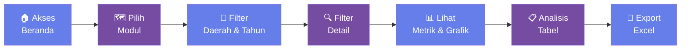

<!-- _class: lead -->

# Sistem Informasi Pelaporan
# Pengadaan Barang dan Jasa
## **SIP 2025**

### Dashboard Monitoring & Pelaporan Terintegrasi

**Kurnia Ramadhan, ST., M.Eng**
Pemerintah Provinsi Kalimantan Barat

21 Desember 2025

---

<!-- _class: content -->

## 📋 Agenda Presentasi

1. **Latar Belakang & Tujuan**
2. **Arsitektur Sistem & Teknologi**
3. **Fitur Utama Aplikasi**
4. **Tour Modul: Rencana, Proses, Monitoring**
5. **Cakupan Data & Integrasi**
6. **Workflow Penggunaan**
7. **Demo & Best Practices**
8. **Roadmap & Pengembangan**

---

<!-- _class: content -->

## 🎯 Latar Belakang

### Tantangan Pengadaan Barang/Jasa

- **Data Tersebar** di berbagai sistem (SIRUP, SPSE, E-Katalog, SiKAP)
- **Pelaporan Manual** memakan waktu dan rawan error
- **Monitoring Real-time** sulit dilakukan
- **Analisis Tren** membutuhkan konsolidasi data kompleks
- **Transparansi & Akuntabilitas** perlu dashboard terpadu

### Solusi: SIP 2025

Dashboard terintegrasi untuk monitoring pengadaan dari **perencanaan** hingga **evaluasi kinerja**

---

<!-- _class: content -->

## 🎯 Tujuan Aplikasi SIP 2025

### Untuk UKPBJ & PPK
- Memantau progres RUP, tender, dan realisasi kontrak secara real-time
- Mengidentifikasi bottleneck dalam proses pengadaan
- Memastikan kepatuhan terhadap regulasi

### Untuk Pimpinan & Auditor
- Dashboard metrik kunci capaian belanja PDN, UKM, dan ITKP
- Laporan siap pakai untuk paparan dan audit
- Mengawasi tata kelola lintas sistem

---

<!-- _class: content -->

## 🎯 Tujuan Aplikasi SIP 2025 (Lanjutan)

### Untuk Analis Data
- Export data ter-filter untuk analisis lanjutan
- Integrasi data historis untuk trend analysis
- Format data standar untuk BI tools

---

## ✨ Fitur Utama (1/2)

### 1️⃣ Filter Multi-Dimensi
- **15 Daerah** (Provinsi + 14 Kab/Kota)
- **Multi-Tahun** (2023-2025 + historis)
- **Sumber Dana** (APBD/APBN/Lainnya)
- **Status PDN/UKM** (TKDN >= 40%)
- **Perangkat Daerah** spesifik

### 2️⃣ Visualisasi Interaktif
- **Card Metrik** otomatis dengan warna konsisten
- **Grafik Pie/Bar** distribusi pagu & HPS
- **Trend Charts** perbandingan periode
- **TOP 10 Ranking** kategori/satker/penyedia

---

<!-- _class: content -->

## ✨ Fitur Utama (2/2)

### 3️⃣ Ekspor & Pelaporan
- **Excel Export** dengan format mata uang Rupiah
- **Auto-naming** file: `Modul-Daerah-Tahun.xlsx`
- **Metadata Filter** tercatat di setiap ekspor
- **Siap Pakai** tanpa cleaning tambahan

---

<!-- _class: content -->

## 🗺️ Peta Modul SIP 2025

```
┌─────────────────────────────────────────────────────┐
│              SISTEM INFORMASI PELAPORAN             │
└─────────────────────────────────────────────────────┘
                          │
          ┌───────────────┼───────────────┐
          ▼               ▼               ▼
    ┌─────────┐     ┌─────────┐    ┌──────────┐
    │ RENCANA │────▶│ PROSES  │───▶│MONITORING│
    └─────────┘     └─────────┘    └──────────┘
         │               │               │
         │               │               │
      📋 RUP        ⚖️ Tender        📊 ITKP
                    📝 Non-Tender    💰 Jenis Belanja
                    ✍️ Pencatatan     📈 Nilai SiKAP
                    📚 E-Katalog v5
                    📖 E-Katalog v6
                    🛒 Toko Daring
                    👥 Peserta Tender
```

---

<!-- _class: content -->

## 📋 Modul RENCANA: RUP

### Fokus Utama
Konsolidasi **Rencana Umum Pengadaan** dari SIRUP untuk baseline perencanaan

### Metrik Kunci
- ✅ **Profil RUP**: Total pagu, jumlah paket penyedia & swakelola
- 📊 **Struktur Anggaran**: Breakdown per perangkat daerah
- 📈 **Persentase Input RUP**: Tingkat kelengkapan data
- 🎯 **Target vs Realisasi**: Perbandingan rencana dengan eksekusi

---

<!-- _class: content -->

## 📋 Modul RENCANA: RUP (Lanjutan)

### Output
- Grafik distribusi pagu per satker
- Tabel detail paket dengan status
- Snapshot historis 31 Maret untuk baseline
- Export Excel ter-filter

---

<!-- _class: content -->

## ⚖️ Modul PROSES: Tender

### 5 Tahapan Tender (End-to-End)
1. **Pengumuman** - Paket yang diumumkan di SPSE
2. **SPPBJ** - Surat Penetapan Penyedia
3. **Kontrak** - E-Kontrak yang ditandatangani
4. **SPMK** - Surat Perintah Mulai Kerja
5. **BAPBAST** - Berita Acara Serah Terima

---

<!-- _class: content -->

## ⚖️ Modul PROSES: Tender (Lanjutan)

### Analisis Mendalam
- 💰 **Nilai & Volume**: Metrik per tahap
- 📊 **Efisiensi**: % penghematan dari HPS
- 🏭 **PDN/UKM**: Capaian produk dalam negeri
- 📍 **Distribusi**: Per kategori & perangkat daerah
- ⏱️ **Timeline**: Durasi proses tender

---

<!-- _class: content -->

## 📝 Modul PROSES: Non-Tender & Pencatatan

### Non-Tender (Pengadaan/Penunjukan Langsung)
- **Tahapan**: Pengumuman → SPPBJ → Kontrak → SPMK → BAST
- **Use Case**: Paket di bawah threshold, kondisi khusus
- **Metrik**: Sama dengan tender untuk komparasi

### Pencatatan Langsung
- **Jenis**: Pencatatan Non-Tender & Pencatatan Swakelola
- **Status**: Berjalan / Selesai / Dibatalkan
- **Fokus**: Paket pagu kecil yang tidak melalui e-tendering

---

<!-- _class: content -->

## 📝 Modul PROSES: Non-Tender & Pencatatan (Lanjutan)

### Output Terintegrasi
- Ringkasan status per jenis
- Perbandingan metode pengadaan
- Trend adopsi e-procurement

---

<!-- _class: content -->

## 📚 Modul PROSES: E-Katalog v5 & v6

### E-Katalog v5 (Sistem Lama)
- **Transaksi E-Purchasing** dari katalog nasional
- **Breakdown**: Per komoditas, satker, penyedia
- **Metrik**: Volume, nilai, jumlah transaksi
- **Efisiensi**: Bandingkan harga katalog vs pasar

### E-Katalog v6 (Sistem Terbaru)
- **Platform Baru** dengan data vendor terintegrasi
- **Status Transaksi**: Pesanan, verifikasi, selesai
- **Monitoring Real-time**: Dashboard transaksi aktif
- **Adoption Rate**: Migrasi dari v5 ke v6

---

<!-- _class: content -->

## 📚 Modul PROSES: E-Katalog v5 & v6 (Lanjutan)

### Insight
📊 Distribusi belanja e-katalog per kategori
🏆 TOP penyedia e-katalog
📈 Trend penggunaan per periode

---

<!-- _class: content -->

## 🛒 Modul PROSES: Toko Daring

### BELA Pengadaan (Belanja Langsung Pengadaan)
Platform marketplace untuk transaksi pengadaan online

### Fokus Monitoring
- **Realisasi Transaksi**: Per perangkat daerah
- **Pelaku Usaha**: Profil & performa penjual
- **Status Verifikasi**: Proses konfirmasi PPMSE
- **Kategori Produk**: Distribusi belanja per jenis

---

<!-- _class: content -->

## 🛒 Modul PROSES: Toko Daring (Lanjutan)

### Metrik Kunci
- 💳 Total nilai transaksi Toko Daring
- 🏪 Jumlah pelaku usaha aktif
- ✅ % transaksi terverifikasi
- 📦 Jumlah produk/jasa terjual

---

<!-- _class: content -->

## 👥 Modul PROSES: Peserta Tender

### Analisis Komprehensif Peserta

#### Statistik Partisipasi
- **Mendaftar**: Total peserta yang register
- **Menawar**: Peserta yang submit penawaran
- **Pemenang**: Peserta yang memenangkan tender

#### Segmentasi
- 🏭 **Ukuran Usaha**: Besar / Menengah / Kecil / Mikro
- 📍 **Persebaran Wilayah**: Lokal vs non-lokal
- ⭐ **Status SiKAP**: Penilaian kinerja penyedia
- 💼 **Jenis Badan Usaha**: PT, CV, UD, Koperasi

---

<!-- _class: content -->

## 👥 Modul PROSES: Peserta Tender (Lanjutan)

#### Insight Strategis
- Tingkat kompetisi per paket
- Dominasi penyedia tertentu
- Peluang untuk UKM lokal

---

<!-- _class: content -->

## 📊 Modul MONITORING: ITKP

### Indeks Kinerja Pelaksana Pengadaan

**ITKP** = Prediksi kinerja pengadaan berdasarkan rasio RUP vs realisasi elektronik

### 6 Area Penilaian

1. **📋 RUP**: Input & kelengkapan rencana
2. **⚖️ E-Tendering**: Tender melalui SPSE
3. **📝 Non E-Tendering**: Non-tender elektronik
4. **📄 E-Kontrak**: Kontrak digital
5. **📚 E-Katalog**: Transaksi katalog elektronik
6. **🛒 Toko Daring**: Belanja marketplace

---

<!-- _class: content -->

## 📊 Modul MONITORING: ITKP (Lanjutan)

### Output
- **Prediksi Nilai ITKP** per daerah
- **Breakdown Score** per aspek
- **Gap Analysis**: Area yang perlu perbaikan
- **Trend Historis**: Perbandingan periode

---

<!-- _class: content -->

## 📈 Modul MONITORING: Nilai SiKAP

### Sistem Informasi Kinerja Penyedia (SiKAP)

Platform penilaian kinerja penyedia barang/jasa pemerintah

### Fokus Monitoring

#### Penilaian Kinerja Penyedia
- **Skor SiKAP**: Rentang nilai kinerja
- **Status Penilaian**: Paket yang sudah/belum dinilai
- **Distribusi Nilai**: Kategori sangat baik / baik / cukup / kurang

---

<!-- _class: content -->

## 📈 Modul MONITORING: Nilai SiKAP (Lanjutan)

#### Analisis
- 🏆 **TOP Penyedia**: Ranking berdasarkan skor
- 📊 **Statistik Penilaian**: Per tender & non-tender
- 🔍 **Blacklist Check**: Penyedia dengan nilai rendah
- 📈 **Trend Kualitas**: Peningkatan/penurunan kinerja

---

<!-- _class: content -->

## 💰 Modul MONITORING: Jenis Belanja

### Klasifikasi Belanja Pemerintah

#### Kategori Utama
1. **💼 Belanja Operasi**: Kebutuhan operasional rutin
2. **🏗️ Belanja Modal**: Aset & infrastruktur
3. **🆘 Belanja Tak Terduga**: Emergency & force majeure

#### Analisis PDN (Produk Dalam Negeri)
- **TKDN >= 40%**: Memenuhi syarat PDN
- **TKDN < 40%**: Non-PDN
- **Capaian Target**: % terhadap total belanja

---

<!-- _class: content -->

## 💰 Modul MONITORING: Jenis Belanja (Lanjutan)

### Metrik Output
- Komposisi belanja per jenis
- Perbandingan PDN vs Non-PDN
- Distribusi per perangkat daerah
- Trend alokasi anggaran

---

<!-- _class: content -->

## 🗄️ Sumber Data & Integrasi

| Sistem | Data | Frekuensi Update | Format |
|--------|------|------------------|--------|
| **SIRUP** | RUP Penyedia, Swakelola, Struktur Anggaran | Harian | Parquet |
| **SPSE** | Tender, Non-Tender, Pencatatan | Harian | Parquet |
| **SiKAP** | Penilaian Kinerja Penyedia | Mingguan | Parquet |
| **E-Katalog v5/v6** | Transaksi E-Purchasing | Mingguan | Parquet |
| **BELA** | Toko Daring Realisasi | Mingguan | Parquet |

### Storage Infrastructure
- **URL**: `https://s3-sip.pbj.my.id`
- **Format**: Parquet (columnar, compressed)
- **Akses**: DuckDB read langsung tanpa ETL
- **Snapshot**: Data 31 Maret tersimpan untuk baseline

---

<!-- _class: content -->

## 🌍 Cakupan Regional

### 15 Daerah Terintegrasi

| Region | Kode RUP | Kode LPSE | Folder |
|--------|----------|-----------|--------|
| Prov. Kalbar | D197 | 97 | `prov` |
| Kota Pontianak | D199 | 62 | `ptk` |
| Kab. Kubu Raya | D202 | 188 | `kkr` |
| Kab. Mempawah | D552 | 118 | `mpw` |
| Kota Singkawang | D200 | 132 | `skw` |
| Kab. Bengkayang | D206 | 444 | `bky` |

**+ 9 kabupaten lainnya** (Landak, Sanggau, Sekadau, Melawi, Sintang, Kapuas Hulu, Ketapang, Tanggerang, Katingan)

---

<!-- _class: content -->

## 🌍 Cakupan Regional (Lanjutan)

### Skalabilitas
✅ Penambahan daerah mudah via `region_config()`
✅ Multi-tenant architecture ready

---

<!-- _class: content -->

## 🔄 Workflow Penggunaan



### Best Practice
1️⃣ Mulai dari **Beranda** untuk overview
2️⃣ Pilih **Daerah & Tahun** sebelum filter detail
3️⃣ Gunakan **Filter Bertahap** untuk fokus analisis
4️⃣ **Compare Periods** untuk trend analysis
5️⃣ **Export Teratur** untuk arsip laporan

---

<!-- _class: content -->

## 🎨 User Interface Highlights

### Navigation Sidebar
- **🏠 HOME**: Dashboard overview
- **📋 RENCANA**: Modul RUP
- **⚖️ PROSES**: 7 sub-modul pengadaan
- **📊 MONITORING**: 3 modul evaluasi

### Interactive Elements
- **Filter Cascading**: Daerah → Tahun → Detail
- **Dynamic Cards**: Auto-refresh metrik
- **Plotly Charts**: Zoom, pan, hover tooltip
- **AgGrid Tables**: Sort, filter, pagination
- **Download Button**: One-click Excel export

---

<!-- _class: content -->

## 🎨 User Interface Highlights (Lanjutan)

### Responsive Design
- Wide layout untuk data maksimal
- Custom CSS untuk branding
- Dark mode ready (`.streamlit/config.toml`)

---

<!-- _class: content -->

## 📥 Fitur Export & Pelaporan

### Auto-Generated Excel

#### Format File
```
[Modul]-[Daerah]-[Tahun].xlsx
```
**Contoh**: `Tender-PROV_KALBAR-2025.xlsx`

#### Konten Excel
- ✅ **Header Metadata**: Filter yang diterapkan
- ✅ **Data Ter-filter**: Sesuai seleksi user
- ✅ **Format Mata Uang**: Rupiah dengan separator (Babel)
- ✅ **Column Headers**: Deskriptif & konsisten

---

<!-- _class: content -->

## 📥 Fitur Export & Pelaporan (Lanjutan)

#### Use Cases
- 📊 Bahan paparan pimpinan
- 🔍 Audit & inspeksi
- 📈 Analisis lanjutan di Excel/BI tools
- 📁 Arsip dokumentasi

---

<!-- _class: content -->

## ⚡ Performa & Optimasi

### Caching Strategy
```python
@st.cache_data(ttl=21600)  # 6 jam
def read_df_duckdb(url, format='parquet'):
    return duckdb.read_parquet(url).df()
```

### Benefits
- ⚡ **Response Time** < 2 detik untuk query kompleks
- 💾 **Memory Efficient** dengan lazy loading
- 🔄 **Auto-refresh** setiap 6 jam
- 📊 **Jutaan Baris** tanpa performance hit

---

<!-- _class: content -->

## ⚡ Performa & Optimasi (Lanjutan)

### DuckDB Advantages
- SQL query langsung ke Parquet
- In-memory processing super cepat
- Filter & agregasi optimized
- Zero ETL overhead

---

<!-- _class: content -->

## 🔐 Data Quality & Governance

### Data Validation
- ✅ Schema consistency check
- ✅ Null value handling
- ✅ Data type enforcement
- ✅ Range & format validation

### Historical Tracking
- 📅 **Snapshot 31 Maret**: Baseline tahunan
- 🔄 **Daily Updates**: Data terkini
- 📊 **Trend Analysis**: Year-over-year comparison
- 🗄️ **Retention**: 3 tahun data historis

---

<!-- _class: content -->

## 🔐 Data Quality & Governance (Lanjutan)

### Compliance
- 📋 Sesuai format LKPP resmi
- 🔒 Akses terkontrol via infrastructure
- 📝 Audit trail ready
- 🎯 SPIP & SOP compliant

---

<!-- _class: content -->

## 📊 Contoh Metrik Dashboard

### Card Metrik Utama
```
┌─────────────────────┬─────────────────────┐
│  💰 Total Pagu      │  📋 Jumlah Paket    │
│  Rp 1.2 Triliun     │  1,234 paket        │
└─────────────────────┴─────────────────────┘
┌─────────────────────┬─────────────────────┐
│  ⚖️ Tender          │  📝 Non-Tender      │
│  Rp 850 M (892)     │  Rp 350 M (342)     │
└─────────────────────┴─────────────────────┘
```

### Grafik Populer
- 🥧 **Pie Chart**: Distribusi per kategori
- 📊 **Bar Chart**: TOP 10 perangkat daerah
- 📈 **Line Chart**: Trend bulanan
- 🗺️ **Treemap**: Hierarki alokasi anggaran

---

<!-- _class: content -->

## 🎯 Use Case: Monitoring Tender

### Scenario
Kepala UKPBJ ingin memantau progres tender Q4 2025

### Steps
1. **Akses Modul Tender** dari sidebar
2. **Filter**: Prov. Kalbar, Tahun 2025, Q4
3. **Lihat Metrik**:
   - 125 paket diumumkan
   - 98 SPPBJ terbit
   - 87 kontrak ditandatangani
   - 65 SPMK diterbitkan
   - 42 BAST selesai

---

<!-- _class: content -->

## 🎯 Use Case: Monitoring Tender (Lanjutan)

### Steps (Lanjutan)
4. **Identifikasi**: 40% paket belum BAST
5. **Deep Dive**: Filter perangkat daerah tertunda
6. **Export**: Download Excel untuk koordinasi
7. **Action**: Follow-up ke satker terkait

---

<!-- _class: content -->

## 🎯 Use Case: Analisis ITKP

### Scenario
Analis ingin evaluasi capaian ITKP tahun berjalan

### Steps
1. **Akses Modul ITKP** dari Monitoring
2. **Filter**: Semua daerah, Tahun 2025
3. **Review Dashboard**:
   - Prediksi ITKP: 85.2 (Target: 80)
   - Area kuat: RUP (95%), E-Tendering (88%)
   - Area lemah: Toko Daring (65%)

---

<!-- _class: content -->

## 🎯 Use Case: Analisis ITKP (Lanjutan)

### Steps (Lanjutan)
4. **Drill-down**: Filter daerah dengan Toko Daring rendah
5. **Insight**: 3 kabupaten belum adopsi BELA
6. **Export**: Data per daerah untuk pembinaan
7. **Rekomendasi**: Sosialisasi Toko Daring ke 3 kabupaten

---

<!-- _class: content -->

## 🎯 Use Case: Pelaporan PDN

### Scenario
Pimpinan perlu laporan capaian PDN untuk rapat koordinasi

### Steps
1. **Akses Modul Jenis Belanja**
2. **Filter**: Provinsi Kalbar, 2025, TKDN >= 40%
3. **Lihat Capaian**:
   - Total Belanja: Rp 1.2 T
   - Belanja PDN: Rp 780 M (65%)
   - Target: 60% ✅ **TERCAPAI**

---

<!-- _class: content -->

## 🎯 Use Case: Pelaporan PDN (Lanjutan)

### Steps (Lanjutan)
4. **Breakdown**:
   - Belanja Modal: 72% PDN
   - Belanja Operasi: 58% PDN
5. **TOP Satker**: Rank perangkat daerah
6. **Export Excel**: Untuk lampiran paparan
7. **Presentasi**: Data siap pakai dalam 5 menit

---

<!-- _class: content -->

## 🛠️ Tips & Best Practices

### Untuk Efisiensi Analisis
✅ **Gunakan Filter Bertahap**: Daerah → Tahun → Detail
✅ **Simpan Filter Favorit**: Catat kombinasi sering dipakai
✅ **Bandingkan Periode**: Gunakan multi-tahun untuk trend
✅ **Export Berkala**: Arsip data per periode pelaporan

### Untuk Kualitas Data
✅ **Cek Timestamp**: Pastikan data ter-update
✅ **Validasi Outlier**: Review nilai ekstrem
✅ **Cross-check**: Bandingkan antar modul (RUP vs SPSE)
✅ **Laporkan Anomali**: Koordinasi dengan tim data

---

<!-- _class: content -->

## 🛠️ Tips & Best Practices (Lanjutan)

### Untuk Kolaborasi
✅ **Standarisasi Naming**: Excel file konsisten
✅ **Dokumentasi Filter**: Catat asumsi analisis
✅ **Share Insight**: Distribusikan temuan ke stakeholder

---

<!-- _class: content -->

## ❓ FAQ - Troubleshooting

### Q: Data kosong setelah filter?
**A**: Pastikan periode/tahun sesuai ketersediaan data di sistem sumber

### Q: Grafik tidak tampil?
**A**: Cek koneksi internet, refresh browser, atau clear cache Streamlit

### Q: Export Excel gagal?
**A**: Pastikan data tidak terlalu besar (>100K baris), coba filter lebih spesifik

### Q: Angka tidak sesuai dengan SPSE?
**A**: Cek timestamp update data, mungkin ada delay sinkronisasi

---

<!-- _class: content -->

## ❓ FAQ - Troubleshooting (Lanjutan)

### Q: Ingin tambah daerah baru?
**A**: Hubungi admin untuk update `region_config()` di `fungsi.py`

### Q: Performa lambat?
**A**: Tunggu cache selesai di first load, berikutnya akan cepat

---

<!-- _class: content -->

## 📊 Dampak & Manfaat

### Efisiensi Waktu
- ⏱️ **Pelaporan**: 80% lebih cepat (dari 2 hari → 2 jam)
- 🔍 **Analisis**: Real-time vs manual bulanan
- 📥 **Export**: One-click vs kompilasi manual

### Kualitas Keputusan
- 📈 **Data-Driven**: Keputusan berbasis metrik objektif
- 🎯 **Proaktif**: Identifikasi issue sebelum menjadi masalah
- 🔄 **Continuous Improvement**: Feedback loop cepat

---

<!-- _class: content -->

## 📊 Dampak & Manfaat (Lanjutan)

### Transparansi & Akuntabilitas
- 👁️ **Visibility**: Semua stakeholder akses data sama
- 📋 **Audit Trail**: Dokumentasi lengkap
- 🏆 **Performance**: Ranking objektif per satker

---

<!-- _class: lead -->

# **DEMO**

## 🚀 Live Application Showcase

### Mari kita lihat SIP 2025 dalam aksi!

**URL**: [https://sip-spse.kalbarprov.go.id](https://sip-spse.kalbarprov.go.id)

---

<!-- _class: lead -->

# Terima Kasih

## **SIP 2025**
### Sistem Informasi Pelaporan Pengadaan

**Made with ❤️ for Transparent Procurement**

---

**Kurnia Ramadhan, ST., M.Eng**
Prakom Muda - UKPBJ Prov. Kalbar

📧 kurnia@ramadhan.me

**Pemerintah Provinsi Kalimantan Barat**
21 Desember 2025
